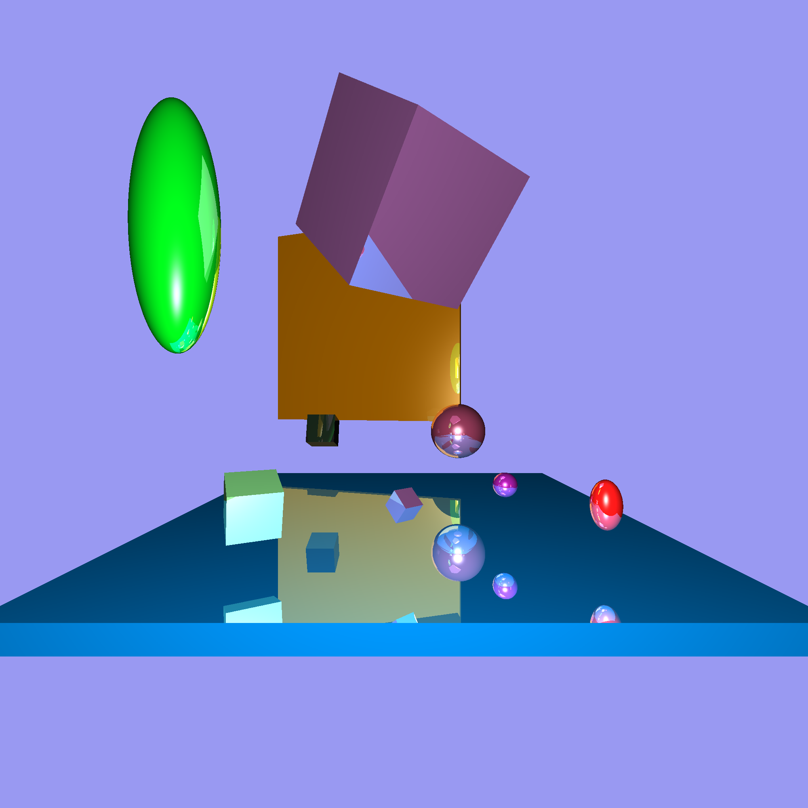

# Rusttracer
This is a command line program written in Rust that uses software rendering to produce
a highly realistic image of a 3D scene.
First, it reads a description of the scene to be rendered from a file.
Next, it calculates the colour of each pixel from the perspective of the point of an 
eye, located at the origin (0,0,0), that is looking towards the negative Z axis.
Finally, these colours are processed and written into .png and .ppm image files.

You can compile the program using Cargo: 

    cargo build --release

To run the program after compiling, you can run the following:

    cargo run --release input-file 

Where input-file is a file that describes the 3D scene for the program to render into .ppm and .png files. 
Example input files are in the SampleInputFiles and OriginalInputFiles directories.
The specification for scene description files is as follows:

Every description file contains each of the following lines exactly once, however they may be ordered arbitrarily: 

	NEAR n
	LEFT l
	RIGHT r
	BOTTOM b
	TOP t
    RES w h
	BACK bR bG bB
    AMBIENT aR aG aB
	OUTPUT filename

Where *n* is positive, *l* < *r* and *b* < *t*.
The viewing window is the rectangle whose top left corner is (*l*,*t*,*-n*) and whose bottom right corner is (*r*,*b*,*-n*).
The viewing window is divided into *w* columns and *h* rows,
where *w* and *h* are integers.
The output image has width *w* and height *h* and is generated by tracing a ray from the origin through each column of each row.
If the ray does not collide with any shape, the pixel has colour (*bR*,*bG*,*bB*) where *bR*, *bG* and *bB* are all between 0 and 1 and represent the red, green and blue background colour respectively.
The ambient lighting colour of the scene is defined by the values *aR*, *aG* and *aB* which are each between 
0 and 1 and, as before, represent red, green and blue respectively.
The rendered image will be stored in .ppm format at the path specified by *filename*, which must end in .ppm. 
If it end

	LIGHT <name> <pos x> <pos y> <pos z> <Ir - red light intensity> <Ig - green light intensity> <Ib - blue light intensity>
	SPHERE <name> <pos x> <pos y> <pos z> <scale x> <scale y> <scale z> <r> <g> <b> <K ambient coefficient> <K diffuse coefficient> <K specular coefficient> <K reflected coefficient> <n brightness>
	CUBE <pos x> <pos y> <pos z> <scale x> <scale y> <scale z> <RX> <RY> <r> <g> <b> <k ambient coefficient> <k diffuse coefficient> <k specular coefficient> <k reflected coefficient> <n brightness>
	