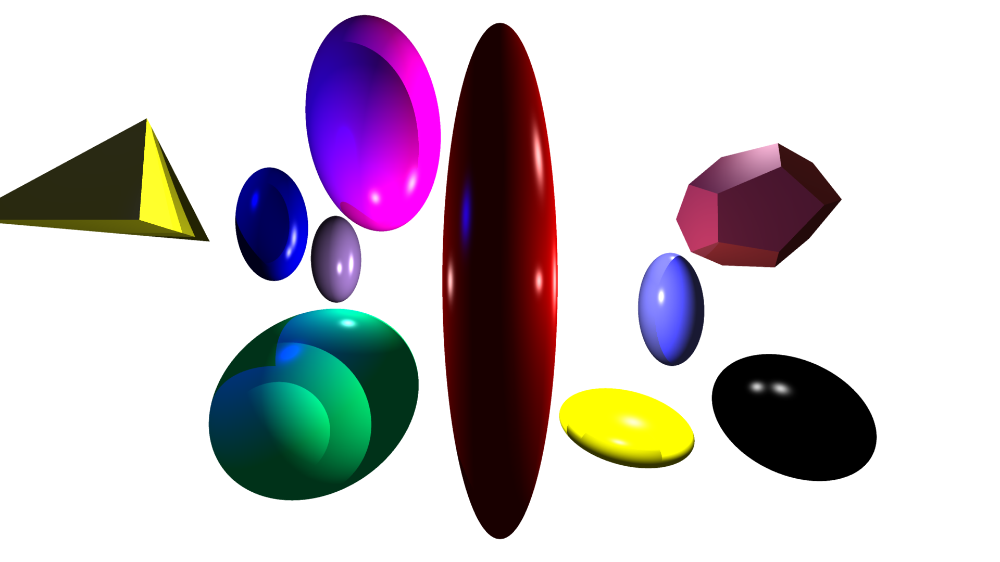

# Rusttracer
This is a command line program written in Rust that uses software rendering to produce
a highly realistic image of a 3D scene.
First, it reads a description of the scene to be rendered from a file.
Next, it calculates the colour of each pixel from the perspective of the point of an 
eye, located at the origin (0,0,0), that is looking towards the negative Z axis.
Finally, these colours are processed and written into .png and .ppm image files.

 
 

You can compile the program using Cargo: 

    cargo build --release

To run the program after compiling, you can run the following:

    cargo run --release input-file 

Where input-file is a file that describes the 3D scene for the program to render into .ppm and .png files. 

Using the *-a* (anti-aliasing) argument will cause the program to trace multiple rays per pixel and use the average of these rays to compute the colour of the pixel. 
This will greatly increase the time needed to render the image but will increase the quality of the produced image, making edges appear more smooth.
Using the *-t* <N> argument will cause *N* threads instead of only 1 to be used when rendering the image.

So, for example, running the following command:

	cargo run --release -- -a -t 8 SampleInputFiles/example1.txt

8 threads participate in rendering and then the following image of increased quality is produced: 

Observe how, with antialiasing, the tip of the red spheroid is smoothed out:

Whereas without it, the tip is jagged:

Example input files are in the SampleInputFiles and OriginalInputFiles directories,
please use these as a reference.
The specification for scene description files is as follows:

Every description file contains each of the following lines exactly once, however they may be ordered arbitrarily: 

	NEAR n
	LEFT l
	RIGHT r
	BOTTOM b
	TOP t
    RES w h
	BACK bR bG bB
    AMBIENT aR aG aB
	OUTPUT filename

Where *n* is positive, *l* < *r* and *b* < *t*.
The viewing window is the rectangle whose top left corner is (*l*,*t*,*-n*) and whose bottom right corner is (*r*,*b*,*-n*).
The viewing window is divided into *w* columns and *h* rows,
where *w* and *h* are integers.
The output image has width *w* and height *h* and is generated by tracing a ray from the origin through each column of each row.
Note that rays will not collide before the viewing window, which 
can cause some objects to appear strangely if they are closer than the viewing window (see OriginalOutputFiles/testImgPlane.ppm for an example of this).
If the ray does not collide with any shape, the pixel has colour (*bR*,*bG*,*bB*) where *bR*, *bG* and *bB* are all between 0 and 1 and represent the red, green and blue background colour respectively.
The ambient lighting colour of the scene is defined by the values *aR*, *aG* and *aB* which are each between 
0 and 1 and, as before, represent red, green and blue respectively.
The rendered image will be stored in .ppm format at the path specified by *filename*, which must end in .ppm. 
This format is not very space efficient as it stores the colour of every single pixel without compression.
Thus an additional .png image (which is more space efficient) will be created at the same path with the last three characters replaced by png.

The description file may contain any number of lines that describe lights, spheres and cubes.
A line describing a light is as follows:

	LIGHT name x y z r g b 

The light is located at (*x*,*y*,*z*) in the scene. The values of *r*, *g*, and *b*
are between 0 and 1 and give the colour of the light in red, green and blue respectively. The value of *name* for lights, spheres and cubes is meant to be a label which could be used for debugging in the future but it is not currently used.

A line describing a sphere is as follows:

	SPHERE name  x  y  z  sX  sY  sZ rX rY rZ r g b kA kD kS kR n

The center of the sphere is located at (*x*,*y*,*z*) in the scene. By default, the sphere has a radius of 1.0
but *sX*, *sY* and *sZ* are scaling coefficients that allow the sphere to be expanded or compressed 
along the *X*, *Y*, or *Z* axis respectively.

The sphere can be rotated around the *X*, *Y*, or *Z* axis using the *rX*, *rY* and *rZ* values 
respectively, whose values should be given in radians. 
Each of these values are optional, if only one of them is omitted it is assumed that the provided values are meant to define *rX* and *rY*, with *rZ* left as 0.0. If two are ommitted it is assumed the provided value is meant to define *rX*, with *rY* and *rZ* left as 0.0.

As before, the values of *r*, *g* and *b* are between 0 and 1 and give the colour of the sphere in red, green and blue respectively. The values of *kA*, *kD*, *kS* and *kR* are lighting coefficients between 0 and 1 
that determine how the colour of the sphere is produced:
	- The value of *kA* determines the contribution of ambient light, 
	- The value of *kD* determines the contribution of diffuse light,
	- The value of *kS* determines the contribution of specular light and
	- The value of *kR* determines the contribution of rays reflected off the sphere.
In each case 0.0 indicates no contribution whereas 1.0 indicates a complete contribution.

The "shininess" of the sphere is given by the value *n* which is at least 1. Higher values of *n* will **reduce** the amount of specular light the sphere gives off.
	
A line describing a cube is very similar, with the semantics of the parameters being the same 
as those for spheres. By default, the cube has edge lengths of 1.0 and is centered around the 
point (*x*,*y*,*z*).
	
	CUBE name  x  y  z  sX  sY  sZ rX rY rZ r g b kA kD kS kR n

	